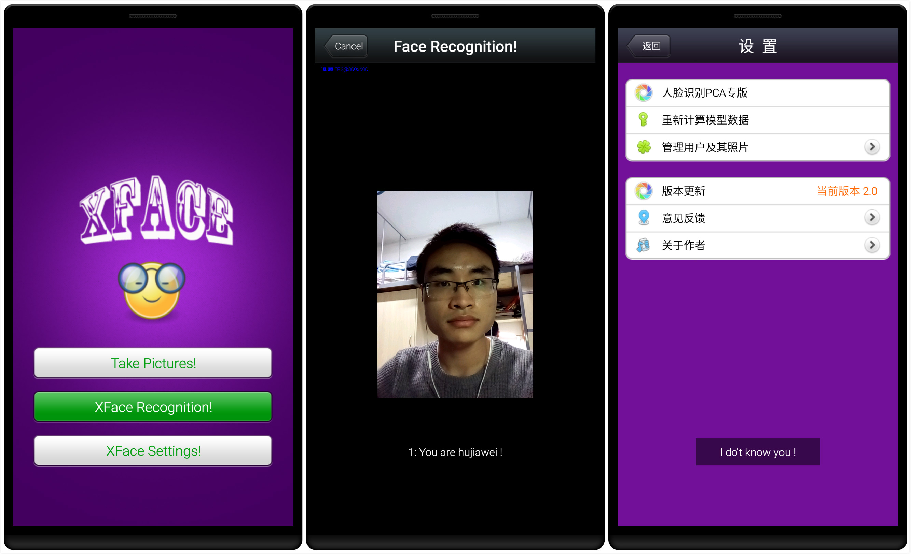

XFace
=====
A Face Recognition Application running on Android Platform.

**界面截图**

**目录说明**

Eclipse目录下是以前用Eclipse+ADT开发的版本，实现了基本功能，bug较多

AndroidStudio目录下是后来用AndroidStudio开发的改进版本，运行较稳定

**相关论文**

[XFace- A Face Recognition System for Android Mobile Phones](XFace.pdf)

**相关文章**

[Android NDK and OpenCV development with Android Studio](http://hujiaweibujidao.github.io/blog/2014/10/22/android-ndk-and-opencv-development-with-android-studio/)

[其他文章链接地址](http://hujiaweibujidao.github.io/mobile/)

如果程序运行有问题，再和我联系之前请确保你阅读了上面的文章内容，谢谢。
